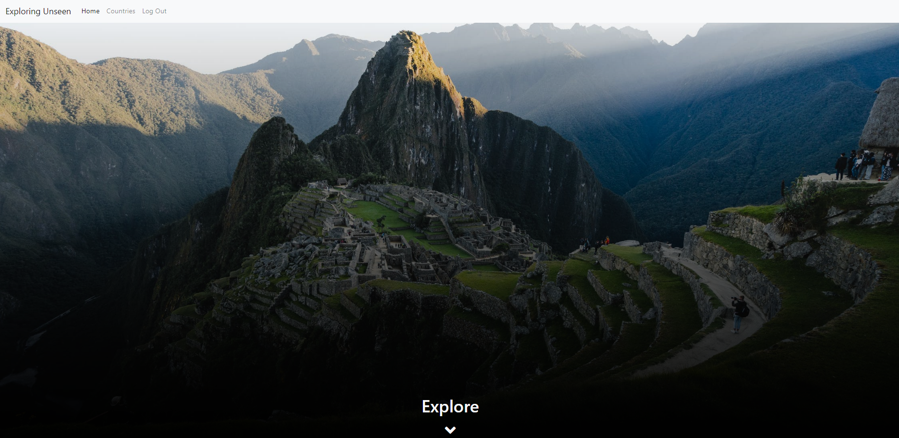
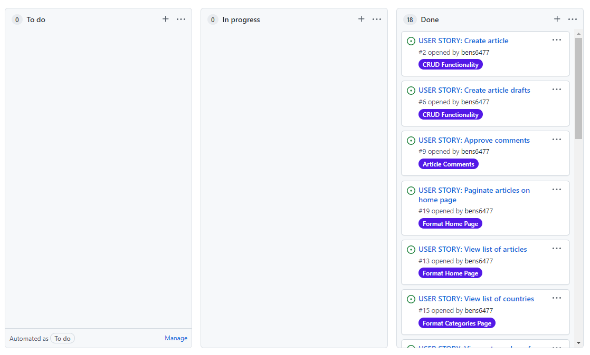
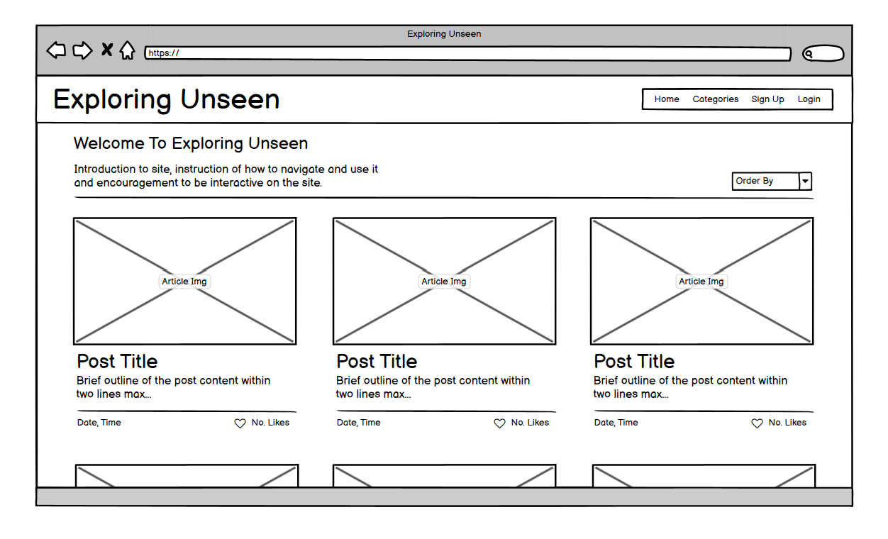
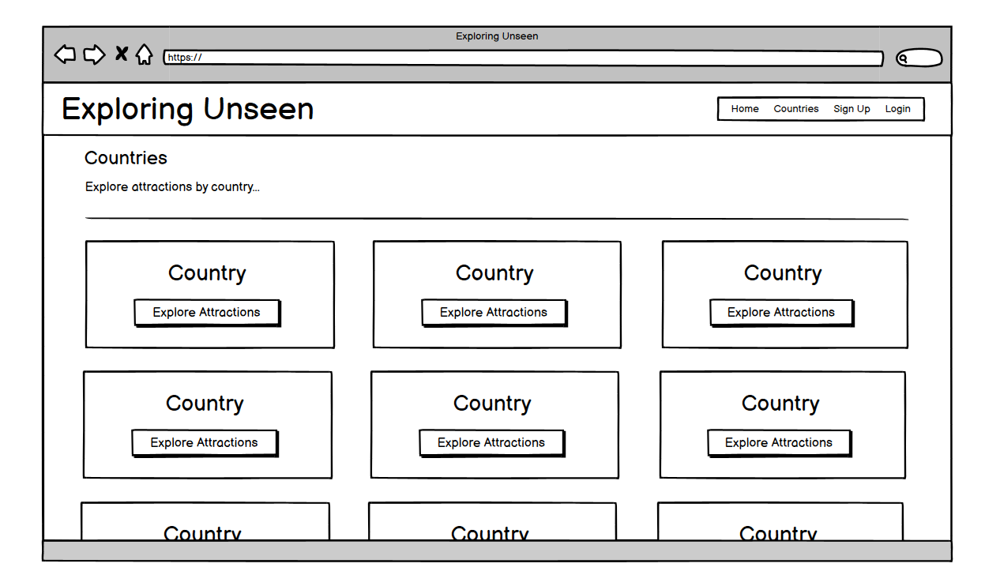
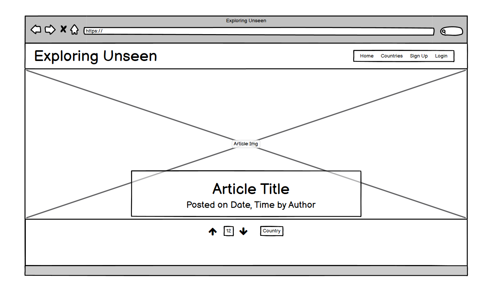
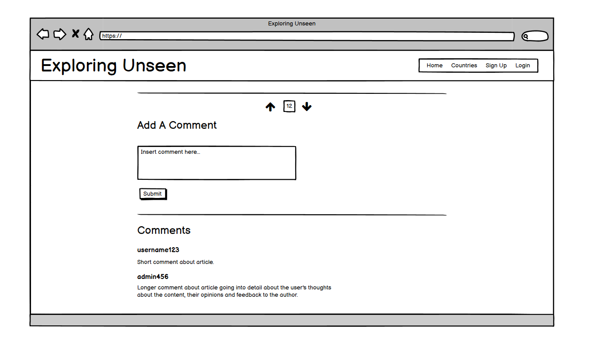
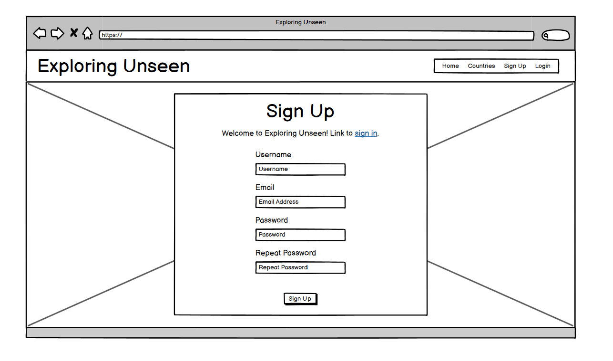
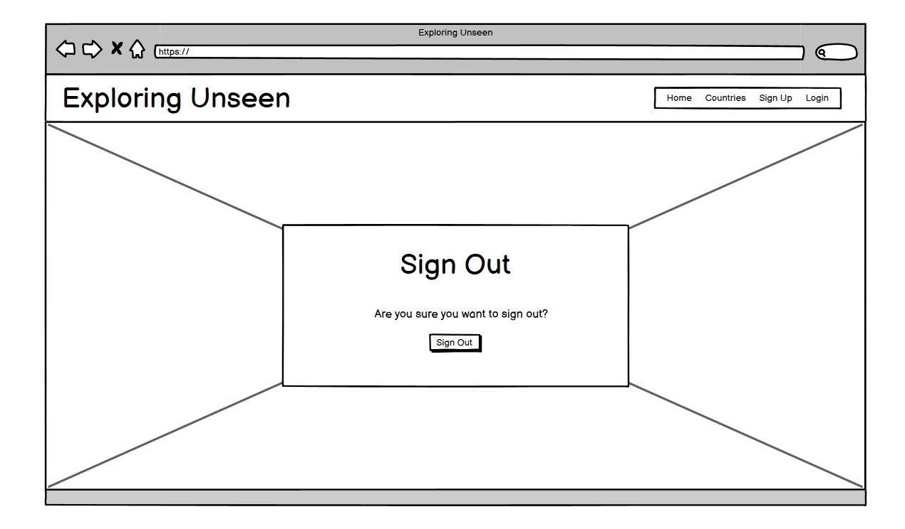
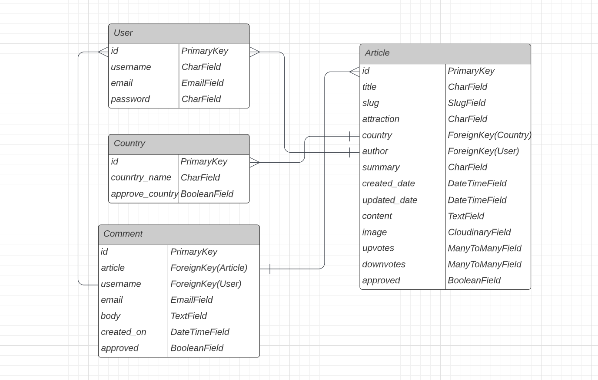
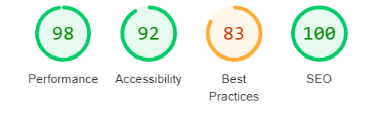

# Exploring Unsen

## Site Overview
Exploring Unseen is an collaborative travel blog created by its users. Discover new places around the world for you to scratch your adventurer itch and start planning your next escapade.

Sign up today to like, comment and share the experiences that others haven't seen.

[Live Site Link](https://exploring-unseen.herokuapp.com/)




## Planning

### Target Audience
* Users who wish to explore new places and attractions.
* Users who are looking to engage in an interactive community of travelers.
* Users who are looking share their traveling highlights favourite places.

### Agile Approach
This project was implemented using an Agile approach to take advantage of the iterative and incremental development.

A key advantage of this approach was the iterative and incremental development, which created a highly adaptable and efficient work schedule. Tasks were completed in stages to fulfil user stories, which incrementally improved the functionality of the website. The project was split into two-day iterations, to review progress and adjust the work schedule accordingly.

GitHub Projects was used to organise the project tasks and timeline. A kanban board was used to move user stories across To Do, In Progress and Done columns according to their status.




### User Stories
The following epics were divided into user stories. See project kanban in repo for more detail.

* Format Home Page
    * Paginate articles on home page
    * Order articles by attribute
    * View list of articles

* User Accounts
    * User sign out
    * User sign in
    * User Account Registration

* Categories Page
    * View list of countries Format

* Article Comments
    * View comments
    * Update comments
    * Comment on an article
    * Approve comments

* Article Votes
    * View net number of votes
    * Upvote / downvote article

* CRUD Functionality
    * Create article drafts
    * Delete article
    * Update article
    * Read Article
    * Create article


### Wireframes

Several wireframes were made prior to building the website to plan the desired layout and functionality.










### Data Model
* This project used Object Oriented programming, utilising model classes to define data.
* PostgreSQL was used to create a relational database of objects
* Four classes were defined: User, Country, Article and Comment
* Data fields were defined for each parameter
* Foreign key fields were used to reference objects in different tables




## Features
* Filter articles by country
* Upvote / Downvote articles
* Leave a comment
* Register an account
* Sign In
* Sign Out


## User Permissions
* Only the article author or superusers (admins) can edit / delete each article. Achieved through <code></code>
* Only superusers can edit / delete countries. Since other articles rely on countries and deleting countries cascade deletes articles, this functionality is restricted to admins only.
* Any authenticated user can add a new country and add a new article, as creating new data does not affect current data in the database.


## Future Enhancements
Various additional features would bring a greater user experience to the website:
* 


## Technology Used
* HTML - Creating and adding content
* CSS - Styling content
* [JavaScript](https://www.javascript.com/) - Manipulating DOM content
* [Python 3](https://www.python.org/downloads/) - Backend code for writing classes methods and functions.
* [Django]() - Full stack framework with convenient shortcuts for effective website backend. Allauth and Coverage extensions were also used for users authentication and testing code coverage respectively.
* [Postgres ]() - Database integrated with Heroku
* [Summernote]() - Inserting styled content
* [Cloudinary ]() - Permanent location for storing images on the cloud 
* [Bootstrap]() - Website structure and styling
* [jQuery]() - Interactivity through bootsrtap scripts
* [Heroku](https://www.heroku.com/home) - Site deployment
* [Font Awesome](https://fontawesome.com/v5.15/icons/) - Arrow icons
* [GitPod](https://www.gitpod.io/) - IDE for local development
* [GIT](https://git-scm.com/) - Version Control
* [GitHub](https://github.com/) - to host the repositories for this project and the live website preview


## Testing
### Automated Testing
Django's built in TestCast library was used to test python functionality.
* test_forms.py - Forms were tested to verify that the correct fields were added and also checked for required fields.
* test_models.py - Models were tested to check the correct fields were added to models and that default values were correct.
* test_views.py - Views were tested to check the correct templates were returned and that client responses were successful.

Automated tests were ran using the following command: <code>python3 manage.py test</code>

### Functionality Testing

* **Test 🧪** - Testing the final code in multiple terminals.
    * **Result 🏆** - All operations were working successfully in both GitPod and the deployed Heroku terminal.
    * **Verdict ✅** - This test passed, frequent assessment of the compatibility of code in both terminals ensured a pass was maintained.

* **Test 🧪** - Testing deployed site across multiple browsers.
    * **Result 🏆** - The deployed Heroku site was successfully tested using Google Chrome, Mozilla Firefox and Microsoft Edge to verify full functionality of the game.
    * **Verdict ✅** - This test passed as, the site functioned successfully across all browsers.


### Validator Testing
* HTML
    * No errors were found when running the HTML code through the [official W3C validator](https://validator.w3.org/)
* CSS
    * No errors were found when running the CSS code through the [official W3C Jigsaw validator](https://jigsaw.w3.org/css-validator/)
* JavaScript
    * No errors were found when running the JavaScript code through the [JSHint validator](https://jshint.com/).
* Python
    * No errors were found when running the Python code through the [PEP8 online validator](http://pep8online.com/).
* Accessibility
    * A high level of accessibility was returned when Lighthouse was ran in Google Chrome developer tools




### Bugs
* **Problem 🐞** - The first commit with django integration pushed a secret key to GitHub in the public domain
    * **Resolution ✅** - This was resolved immediately in the next commit using the env.py file. This contained sensitive data not to be publicly accessible on GitHub and was withheld using the .gitignore file.

### Bugs
* **Problem 🐞** - When running automated tests models could not be accessed.
    * **Resolution ✅** - Added an if statement to check if "test" was included in the cli command. If so, access the sqlite3 database, and if not access the dj_database_url database.

```
if 'test' in sys.argv:
    #Configuration for test database
    DATABASES = {
        'default': {
            'ENGINE': 'django.db.backends.sqlite3',
            'NAME': BASE_DIR / 'db.sqlite3',
        }
    }
else:
  #Default configuration
    DATABASES = {
        'default': dj_database_url.parse(os.environ.get('DATABASE_URL'))
    }"
```


### Unfixed Bugs
* No known bugs have been left unfixed


## Deployment

### Cloning Repository
You can clone this repository to view, edit and run the code. The steps to clone the repository are as follows:

1. Within the repository, navigate to the 'Code' drop-down menu, select 'HTTP' and copy the URL.
1. Open Git Bash from your IDE of choice.
1. Navigate the current working directory to your desired location.
1. To clone the repository, type <code>git clone</code> into the terminal followed by the repository URL, in this case <code>git clone https://github.com/bens6477/exploring-unseen-blog</code>.
1. Create an env.py file and add the following code. Create your own SECRET_KEY and get CLOUDINARY_URL from your Cloudinary account 
```
import os
os.environ["CLOUDINARY_URL"] = "Enter CLOUDINARY_URL”
os.environ["SECRET_KEY"] = "Enter SECRET_KEY"
```
1. Add env.py to .gitignore file to prevent this data from being added to the public domain on GitHub
1. Install the required modules using <code>pip3 install -r requirements.txt</code>
1. Add <code>DEVELOPMENT = True</code>
1. To run the site use <code>python3 manage.py runserver</code>


### Deployment to Heroku
This app was created using the [python essentials template](https://github.com/Code-Institute-Org/python-essentials-template) developed by the Code Institute and the site was deployed to Heroku. The steps to deploy are as follows:
1. From the user dashboard select 'Create New App'.
1. Enter a unique app name and select the current region. This project was deployed from the UK, Europe.
1. Once the skeleton of the app has been created, navigate to the 'Settings' tab.
1. Add CLOUDINARY_URL and SECRET_KEY as config vars
1. Click 'Add buildpack' and type in "Heroku/Postgres" and then click 'Save changes'.
1. Add DATABASE_URL from Heroku config vars to env.py: <code>os.environ["DATABASE_URL"] = "DATABASE_URL”</code>
1. Create a Procfile using <code>web: gunicorn [appname].wsgi:application</code>
1. Create a requirements.txt file using <code>pip3 freeze --local > requirements.txt</code>
1. Navigate to the 'Deploy' tab in the app menu.
1. Under the 'Deployment method' subsection select GitHub and click 'Connect to GitHub'.
1. In the 'repo-name' field type the repository name and click search, and then below click 'Connect'. In this case the repo-name was "battleships".
1. Under the 'Automatic deploys' subsection click 'Enable Automatic Deploys'.
1. Migrate changes using <code>python3 manage.py migrate</code>, commit and push code to GitHub.
1. After the app has been deployed, click 'View' to open the deployed site in a new tab. Alternatively, scroll to the top of the app workspace and click 'Open app'.
1. The live link can be found here - https://exploring-unseen.herokuapp.com/


## Credits
* [Django Documentation](https://docs.djangoproject.com/en/3.2/)
* Cloudinary documentation including [installation](https://cloudinary.com/documentation/django_image_and_video_upload)
* Summernote documentation including [installation](https://summernote.org/getting-started/#installation)
* [Linear gradient background](https://codepen.io/kaustavbanerjee/pen/JKZPve)

### Articles
* [The Gorges of the Ardèche](https://www.avignon-et-provence.com/en/natural-sites/gorges-ardeche)
* [Fairy Pools](https://www.dunvegancastle.com/fairy-pools/)
* [Stonehenge](https://www.nationalgeographic.com/history/article/stonehenge-1)
* [Alhambra](https://www.alhambra.org/en/alhambra-history.html)

