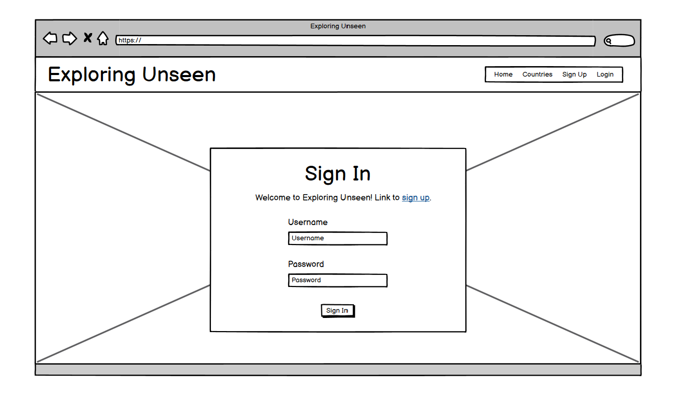

# Explore Unseen Blog

## Notes
The first commit with django integration pushed a secret key to GitHub, however this was resolved immediately in the next commit using the env.py file. This contained sensitive data not to be publicly accessible on GitHub and was withheld using the .gitignore file.

To Write About
* Linear gradient background - also has the effect of dimming as user scrolls down
https://codepen.io/kaustavbanerjee/pen/JKZPve

* Add hero image through external javascript file using data-hero-page custom attribute and switch case logic. Inspiration from RPSLS and simon-game.

# Battleships Game

## Site Overview
This project uses a mock terminal deployed in Heroku to host a computerised version of the classic board game Battleships. 

Based on the original [1990 Milton Bradley game rules](https://www.hasbro.com/common/instruct/Battleship.PDF), each player has 5 ships in their fleet, and players take turns guessing the coordinates of their opponent's ships. If the player guesses correctly, a red X is placed in the cell, and if it is wrong it's filled with a yellow ⌀. The first player to sink all of their opponent's ship wins. 

This app is a simple, fast-paced app which you can play against the computer in a short-duration. Do you have what it takes to beat the computer?

## Contents
1. [Site Overview](#site-overview)
1. [Planning](#planning)
    * [Target Audience](#target-audience)
    * [User Stories](#user-stories)
    * [Data Model](#data-model)
    * [Flowcharts](#flowcharts)
    * [Styling](#styling)
1. [Features](#features)
    * [Game Introduction](#game-introduction)
    * [Defensive Design](#defensive-design)
    * [User Name Input](#user-name-input)
    * [Ship Placement](#ship-placement)
    * [Valid User Guess](#valid-user-guess)
    * [Randomised Computer Guess](#randomised-computer-guess)
    * [Shot Outcome](#shot-outcome)
    * [Game Winner](#game-winner)
    * [Play Again](#play-again)
1. [Future Enhancements](#future-enhancements)
1. [Technology Used](#technology-used)
1. [Libraries](#libraries)
    * [random](#random)
    * [os](#os)
    * [copy](#copy)
1. [Testing](#testing)
    * [Functionality Testing](#functionality-testing)
    * [Validator Testing](#validator-testing)
    * [Bugs](#bugs)
    * [Unfixed Bugs](#unfixed-bugs)
1. [Deployment](#deployment)
    * [Heroku](#heroku)
    * [Cloning Repository](#cloning-repository)
1. [Credits](#credits)

## Planning

### Agile Approach
This project was implemented using an Agile approach to take advantage of the iterative and incremental development.

A key advantage of this approach was the iterative and incremental development, which created a highly adaptable and efficient work schedule. Tasks were completed in stages to fulfil user stories, which incrementally improved the functionality of the website. The project was split into two-day iterations, to review progress and adjust the work schedule accordingly.

Jira was used to organise the project tasks and timeline. A kanban board was used to move user stories across To Do, In Progress and Done columns according to their status.

The project board can be viewed [here](https://bens6477.atlassian.net/jira/software/projects/EUB/boards/1).

Epics were refined into User Stories and further split into specific Tasks to complete.

### Target Audience
* Users who wish to explore new places and attractions.
* Users who are looking to engage in an interactive community of travelers.
* Users who are looking share their traveling highlights favourite places.

### User Stories
As a user, I want:
* A simple, clean layout, providing everything I need for smooth gameplay.
* To view instructions on how to play the game.
* To view a clean game area with only the essential information for each stage.
* To easily input data in an intuitive manner.
* To be clearly informed of errors when I've given invalid information. 
* To easily view the outcome of each guess.
* To easily reset the game to play again as many times as desired.

### Wireframes

Several wireframes were made prior to building the website to plan the desired layout and functionality.

### Data Model
* This project used Object Oriented programming, utilising model classes to define data.
* PostgreSQL was used to create a relational database of objects
* Four classes were defined: User, Country, Article and Comment
* Data fields were defined for each parameter
* Foreign key fields were used to reference objects in different tables

### Styling

#### Text Colouring
* Specific phrases and characters are assigned different colours depending on the data they represent.
* User input requests are printed in green to emphasise the required action to the user.
* "Enter to continue" messages are printed in blue to also draw attention, however to differentiate between inputting data and simply pressing Enter.
* This improves the readability of the game and improves the user experience as the player can differentiate between data quickly and it is much more pleasing to look at.

Colour dependent data is as follows:

## Features

###

## Future Enhancements
Various additional features would bring a greater user experience to the website:
* 

## Technology Used
* HTML - Creating and adding content
* CSS - Styling content
* [JavaScript](https://www.javascript.com/) - Manipulating DOM content
* [Python 3](https://www.python.org/downloads/) - Backend code for writing classes methods and functions.
* [Django]() - Full stack framework with convenient shortcuts for effective website backend. Allauth and Coverage extensions were also used for users authentication and testing code coverage respectively.
* [Postgres ]() - Database integrated with Heroku
* [Summernote]() - Inserting styled content
* [Cloudinary ]() - Permanent location for storing images on the cloud 
* [Bootstrap]() - Website structure and styling
* [jQuery]() - Interactivity through bootsrtap scripts

* [Heroku](https://www.heroku.com/home) - Site deployment
* [Font Awesome](https://fontawesome.com/v5.15/icons/) - Arrow icons
* [GitPod](https://www.gitpod.io/) - IDE for local development
* [GIT](https://git-scm.com/) - Version Control
* [GitHub](https://github.com/) - to host the repositories for this project and the live website preview

## Testing
### Automated Testing
Django's built in TestCast library was used to test python functionality.
* test_forms.py - Forms were tested to verify that the correct fields were added and also checked for required fields.
* test_models.py - Models were tested to check the correct fields were added to models and that default values were correct.
* test_views.py - Views were tested to check the correct templates were returned and that client responses were successful.

Automated tests were ran using the following command: <code>python3 manage.py test</code>

### Functionality Testing

* **Test 🧪** - Testing the final code in multiple terminals.
    * **Result 🏆** - All operations were working successfully in both GitPod and the deployed Heroku terminal.
    * **Verdict ✅** - This test passed, frequent assessment of the compatibility of code in both terminals ensured a pass was maintained.

* **Test 🧪** - Testing deployed site across multiple browsers.
    * **Result 🏆** - The deployed Heroku site was successfully tested using Google Chrome, Mozilla Firefox and Microsoft Edge to verify full functionality of the game.
    * **Verdict ✅** - This test passed as, the site functioned successfully across all browsers.

### Validator Testing
* No errors were found when running the HTML code through the [official W3C validator](https://validator.w3.org/)
* No errors were found when running the CSS code through the [official W3C Jigsaw validator](https://jigsaw.w3.org/css-validator/)
* No errors were found when running the JavaScript code through the [JSHint validator](https://jshint.com/).
* No errors were found when running the Python code through the [PEP8 online validator](http://pep8online.com/).

### Bugs
* **Problem 🐞** - The first commit with django integration pushed a secret key to GitHub in the public domain
    * **Resolution ✅** - This was resolved immediately in the next commit using the env.py file. This contained sensitive data not to be publicly accessible on GitHub and was withheld using the .gitignore file.

### Bugs
* **Problem 🐞** - 
    * **Resolution ✅** - 

### Bugs
* **Problem 🐞** - 
    * **Resolution ✅** - 

### Bugs
* **Problem 🐞** - 
    * **Resolution ✅** - 

### Unfixed Bugs
* 

## Deployment
### Heroku
This app was created using the [python essentials template](https://github.com/Code-Institute-Org/python-essentials-template) developed by the Code Institute and the site was deployed to Heroku. The steps to deploy are as follows:
1. From the user dashboard select 'Create New App'.
1. Enter a unique app name and select the current region. This project was deployed from the UK, Europe.
1. Once the skeleton of the app has been created, navigate to the 'Settings' tab.
1. Click 'Reveal Config Vars' and type in "PORT" to the 'KEY' field and "8000" to the 'VALUE' field. Press Add to confirm.
1. Click 'Add buildpack' and type in "heroku/python" and then click 'Save changes'. Alternatively click on the python icon to auto-fill the field with "heroku/python".
1. Click 'Add buildpack' again and type in "heroku/nodejs" and then click 'Save changes'. Alternatively click on the nodejs icon to auto-fill the field with "heroku/nodejs".
1. Ensure the order of the buildpacks starts with "heroku/python" and is followed by "heroku/nodejs".
1. Navigate to the 'Deploy' tab in the app menu.
1. Under the 'Deployment method' subsection select GitHub and click 'Connect to GitHub'.
1. In the 'repo-name' field type the repository name and click search, and then below click 'Connect'. In this case the repo-name was "battleships".
1. Under the 'Automatic deploys' subsection click 'Enable Automatic Deploys'.
1. After the app has been deployed, click 'View' to open the deployed site in a new tab. Alternatively, scroll to the top of the app workspace and click 'Open app'.
1. The live link can be found here - https://github.com/bens6477/battleships

### Cloning Repository
You can clone this repository to view, edit and run the code. The steps to clone the repository are as follows:

1. Within the repository, navigate to the 'Code' drop-down menu, select 'HTTP' and copy the URL.
1. Open Git Bash from your IDE of choice.
1. Navigate the current working directory to your desired location.
1. To clone the repository, type <code>git clone</code> into the terminal followed by the repository URL, in this case <code>git clone https://github.com/bens6477/battleships</code>.
1. Press 'Enter'.

## Credits
* [Django Documentation](https://docs.djangoproject.com/en/3.2/)
* Cloudinary documentation including [installation](https://cloudinary.com/documentation/django_image_and_video_upload)
* Summernote documentation including [installation](https://summernote.org/getting-started/#installation)

### Articles
* [The Gorges of the Ardèche](https://www.avignon-et-provence.com/en/natural-sites/gorges-ardeche)
* 
* 
* 
* 
* 